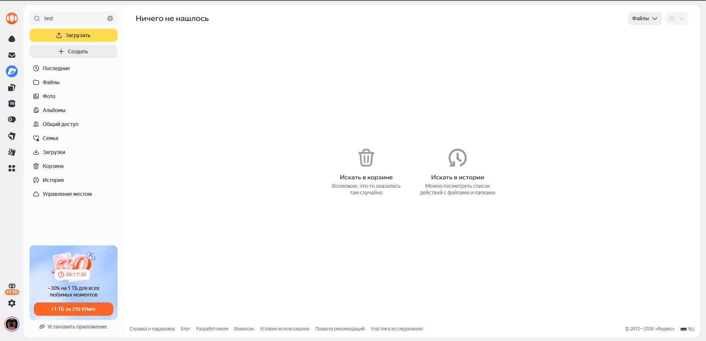
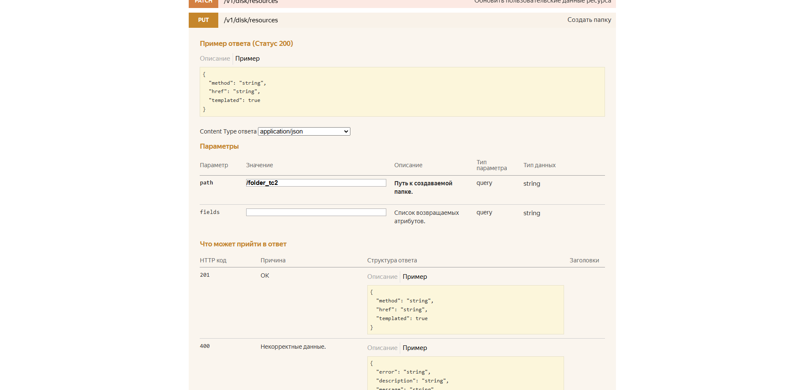
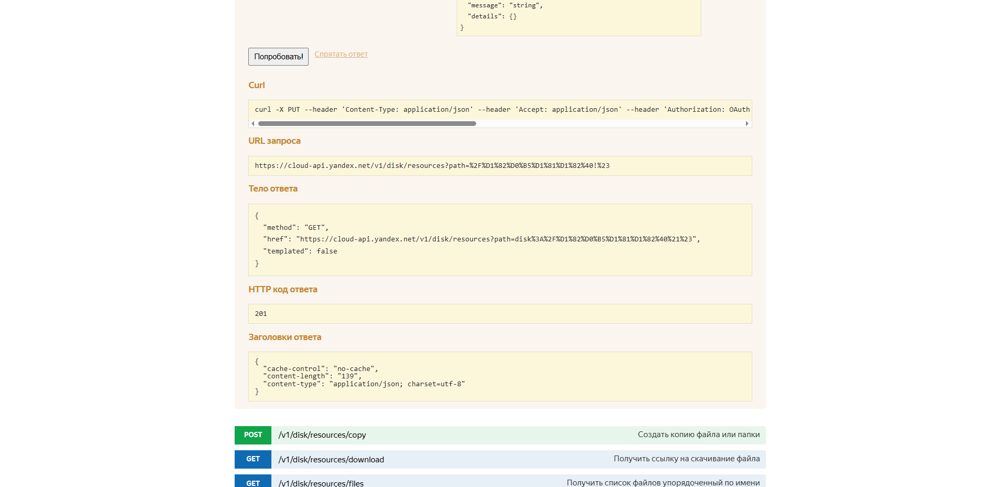
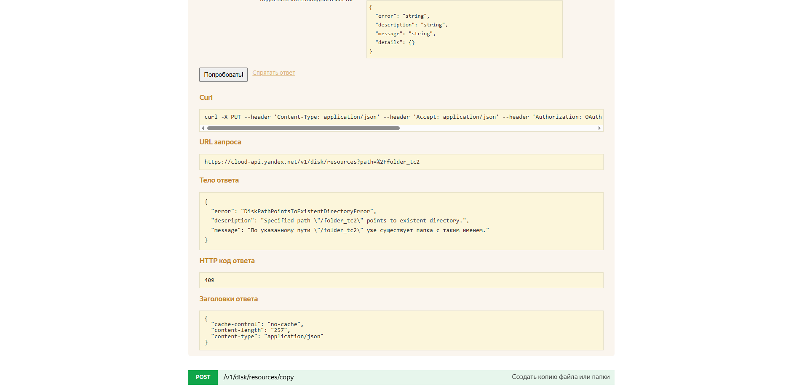

# Задача 2. Написание баг-репорта

## Часть 1. UI тестирование

### 1. Тестирование требований

Функциональные требования:
1. Поле поиска принимает любые буквы, цифры и символы.
2. Поиск осуществляется по всем файлам и папкам пользователя.
3. В результате выводятся все объекты, удовлетворяющие запросу.
4. Если результатов нет, выводится сообщение:  
   "В вашем Диске не найдено файлов или папок по запросу <...>"
5. Файлы из корзины также находятся поиском.


### 2. Тест-кейсы (UI)

| № | Предусловие                       | Действие                               | Ожидаемый результат                                                               |
|---|-----------------------------------|----------------------------------------|-----------------------------------------------------------------------------------|
| 1 | Открыт Яндекс.Диск, есть 2 файла  | Ввести в поиск существующее имя файла  | Отображён найденный файл                                                          |
| 2 | Файл удалён в корзину             | Найти этот файл по имени               | Файл найден и отображён (с пометкой "Корзина")                                    |
| 3 | Нет совпадений                    | Ввести "bababa"                        | Показано сообщение "В вашем Диске не найдено файлов или папок по запросу "bababa" |
| 4 | Ввести комбинацию символов "@#$%" | Нажать "Поиск"                         | Система не падает, выдает корректное сообщение об отсутствии результатов          |
| 5 | Ввести часть имени файла          | Проверить результат                    | Найдены файлы, содержащие введённую подстроку                                     |

### 3. Баг-репорт

ID: UI-001  
Заголовок: Файл, находящийся в корзине, не отображается в результатах поиска  
Предусловия:  
- На Яндекс.Диске сохранён файл test.jpg  
- Файл удалён в корзину  

Шаги:
1. Открыть Яндекс.Диск  
2. Ввести в строку поиска `test.jpg`  
3. Запустить поиск  

Ожидаемый результат:  
Файл test.jpg должен быть отображён в результатах поиска с пометкой, что он находится в корзине.  

Фактический результат:  
Файл не найден, выведено сообщение: *"Ничего не нашлось"*  

Окружение:  
OS: Windows 11  
Browser: Google Chrome 145.0.7632.46  
Build: Yandex Disk Web 2026.02  

Вложения:  


---

## Часть 2. API тестирование

### 1. Тестирование требований

Метод:  
PUT /v1/disk/resources  

Заголовки:  
- Content-Type: application/json  
- Authorization: [token]  

Параметры запроса:
- path – путь к создаваемой папке  
- fields – список атрибутов для возврата  

Коды ответов:
- 200 — Успешно, папка создана  
- 400 — Ошибка данных или путь уже существует  
- 401 — Неверный или отсутствующий токен  
 

### 2. Тест-кейсы (API)

| № | Описание                                          | Входные данные            | Ожидаемый ответ                               |
|---|---------------------------------------------------|---------------------------|-----------------------------------------------|
| 1 | Создание новой папки                              | path=/folder_tc2          | 200, папка создана                            |
| 2 | Создание папки по уже существующему пути          | path=/folder_tc2          | 400, "DiskPathPointsToExistentDirectoryError" |
| 3 | Токен не указан                                   | Authorization отсутствует | 401, "error": "UnauthorizedError"             |
| 4 | Валидный токен, папка `/folder_tc2` создана ранее | fields=path,name          | Ответ содержит только запрошенные поля        |

### 3. Баг-репорт 

ID: API-002  
Заголовок: При создании папки, сервер возвращает код 201 вместо ожидаемого 200  
Предусловия:  
- Валидный QAuth токен  
- На Диске нет папки `/folder_tc2`   

**Шаги для воспроизведения:**
1. Открыть Яндекс Полигон
2. Отправить запрос `PUT /v1/disk/resources?path=/folder_tc2`
3. Проверить ответ

**Ожидаемый результат:**  
HTTP 200, папка `folder_tc2` создается на диске

**Фактический результат:**  
HTTP 201, тело ответа:
```json
{
  "method": "GET",
  "href": "https://cloud-api.yandex.net/v1/disk/resources?path=disk%3A%2F%D1%82%D0%B5%D1%81%D1%82%40%21%23",
  "templated": false
} 
```




---

ID: API-003  
Заголовок: При попытке создании, уже существую папки, сервер возвращает код 409 вместо ожидаемого 400  
Предусловия:  
- Валидный QAuth токен  
- На Диске есть папка `/folder_tc2`   

**Шаги для воспроизведения:**
1. Открыть Яндекс Полигон
2. Отправить запрос `PUT /v1/disk/resources?path=/folder_tc2`
3. Проверить ответ

**Ожидаемый результат:**  
HTTP 400, папка `folder_tc2` существует на диске

**Фактический результат:**  
HTTP 409, тело ответа:
```json
{
  "error": "DiskPathPointsToExistentDirectoryError",
  "description": "Specified path \"/folder_tc2\" points to existent directory.",
  "message": "По указанному пути \"/folder_tc2\" уже существует папка с таким именем."
}
```


